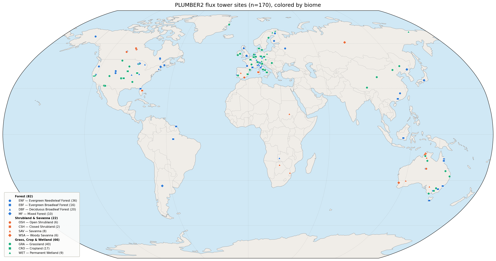

# plumber2-ecland

Scripts and configuration to run [ecLand](https://www.ecmwf.int/en/research/modelling-systems/land-surface) land-surface model simulations over the [PLUMBER2](https://gmd.copernicus.org/articles/15/5511/2022/) 170 sites.


## Repository layout

```
plumber2-ecland/
├── clim/PLUMBER2/          # Climatology input files (NetCDF, tracked via Git LFS)
├── forcing/PLUMBER2/       # Meteorological forcing files (NetCDF, tracked via Git LFS)
├── namelists/              # ecLand namelist configuration files
├── scripts/                # Run, post-processing and validation scripts
│   └── all_sites_plumber2.txt      # Complete list of 170 PLUMBER2 sites
│   └── best_sites_to_benchmark.txt  # Curated list of 42 benchmark sites
├── output/                 # Model output — excluded from git
└── postprocessed/          # Post-processed output — excluded from git
```

## Getting started

Clone the repository with Git LFS support so that the NetCDF pointer files are fetched correctly:

```bash
# Install Git LFS if not already available
git lfs install

# Clone the repository
git clone git@github.com:gpbalsamo/plumber2-ecland.git
cd plumber2-ecland
```

The `forcing/PLUMBER2/` and `clim/PLUMBER2/` directories contain LFS pointers after cloning. Run the following to download the actual NetCDF files:

```bash
bash scripts/ecland_retrieve_lfs.sh --all
```

## Requirements

- ecLand executable (built separately; see [ECMWF ecLand](https://github.com/ecmwf-ifs/ecland))
- ECMWF HPC environment with the following modules:
  - `prgenv/intel`, `intel/2021.4`
  - `hpcx-openmpi/2.9`, `netcdf4/4.9.1`
  - `python3`
- Python packages: `numpy`, `xarray`, `netCDF4`

## Usage

### 1. Retrieve forcing and clim data

Copy forcing and clim files from git-lfs to your local plumber2-ecland repo:

```bash
scripts/ecland_retrieve_lfs.sh --all
```

### 2. Run experiment and postprocess output

Edit `scripts/run_and_proc_plumber2.sh` to set paths and options, then:

```bash
bash scripts/run_and_proc_plumber2.sh
```

Note this script make use of the lower-level script which can be run directly:

```bash
scripts/ecland_run_experiment.sh \
  -g PLUMBER2 \
  -t insitu \
  -i <input_dir> \
  -o <output_dir> \
  -n namelists/namelist_ecland_50R1_ctl \
  -x <path_to_ecland_executable> \
  -w <work_dir>
```

The postprocessing of model output is done by `scripts/postproc_plumber2.py`

```bash
python3 scripts/postproc_plumber2.py \
  --input-dir <output_dir> \
  --output-dir <postprocessed_dir>
```

### 3. Check results

To check the postprocessed output run:
```bash
python3 scripts/check_plumber2_dates.py
```

## Benchmarking

A curated list of 42 recommended benchmark sites (selected by Gab) is provided in `scripts/best_sites_to_benchmark.txt`. These sites offer good spatial and biome diversity and are suitable for model evaluation.

To run ecLand only over the benchmark sites:

```bash
scripts/ecland_run_experiment.sh \
  -g PLUMBER2 \
  -t insitu \
  -S scripts/best_sites_to_benchmark.txt \
  -x <path_to_ecland_executable>
```

To post-process and validate only the benchmark sites:

```bash
python3 scripts/postproc_plumber2.py --site $(paste -sd' ' scripts/best_sites_to_benchmark.txt | sed 's/ / --site /g')
python3 scripts/check_plumber2_dates.py
```

## Namelist

The default namelist `namelists/namelist_ecland_50R1_ctl` corresponds to the ecLand 50R1 control configuration.

## License

Copyright 2023– ECMWF. Licensed under the [Apache Licence Version 2.0](http://www.apache.org/licenses/LICENSE-2.0).
